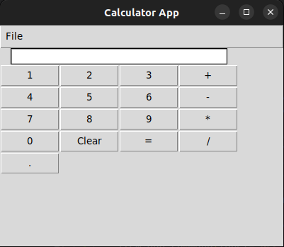
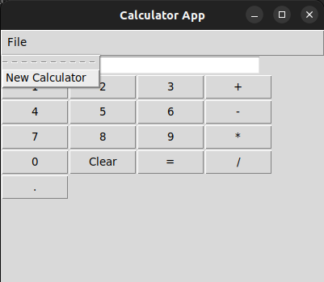

# A Python Graphical User Interface Calculator

## Description
This is a simple graphical user interface (GUI) calculator written in Python using the Tkinter library. It allows users to perform basic arithmetic operations.

## Screenshots 

- Calculator 

  

- Calculator Menu
  
